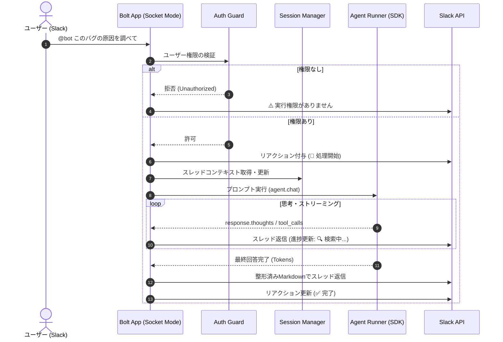

# 02. システムアーキテクチャ設計

本ドキュメントでは、`antigravity-gateway` の全体アーキテクチャ、コンポーネント構成、データフロー、およびローカル／クラウド共通で動作するポータビリティ設計を定義します。

---

## 1. システム全体構成図

```mermaid
flowchart TB
    subgraph SlackPlatform [Slack プラットフォーム]
        User([ユーザー])
        Channel[Slack チャンネル / スレッド]
        SlackGateway[Slack WebSocket Gateway / Events]
        User -->|メンション / スレッド返信| Channel
        Channel <--> SlackGateway
    end

    subgraph GatewayCore [antigravity-gateway (常駐プロセス)]
        direction TB
        BoltApp[Slack Bolt (Socket Mode)]
        AuthGuard[Security & Auth Guard<br/>(User Whitelist)]
        SessionMgr[Session / Thread Manager]
        Converter[Markdown / Block Kit Converter]

        subgraph AGYEngine [Antigravity Runtime]
            SDK[google.antigravity SDK]
            AgentInstance[Agent Lifecycle Handler]
            Capabilities[CapabilitiesConfig<br/>(Read-only / Commands)]
        end

        subgraph Storage [Local / Workspace]
            WorkDir[(Target Workspace Repo)]
            ArtifactsDir[(./artifacts/ Store)]
        end
    end

    subgraph OptionalViewer [フェーズ2: 軽量 Web ビューワー]
        FastAPIServer[FastAPI Web Server]
        Tunnel[Cloudflare Tunnel / ngrok]
        BrowserViewer([ブラウザ (Plan / Diff 閲覧)])
    end

    SlackGateway <== WebSocket (外向き) ==> BoltApp
    BoltApp --> AuthGuard
    AuthGuard --> SessionMgr
    SessionMgr --> AgentInstance
    AgentInstance --> SDK
    SDK --> Capabilities
    Capabilities --> WorkDir
    AgentInstance -->|Thoughts / Streaming| Converter
    AgentInstance -->|Artifacts 生成| ArtifactsDir
    Converter --> BoltApp
    
    ArtifactsDir -.-> FastAPIServer
    FastAPIServer <--> Tunnel <--> BrowserViewer
```

---

## 2. 主要コンポーネントの役割

| コンポーネント | ファイル | 役割・責務 |
| :--- | :--- | :--- |
| **Slack App (Bolt)** | `src/bot.py` | Slack Socket Mode による接続管理、メンションやメッセージイベントの受信・ルーティング。 |
| **Auth Guard** | `src/security.py` | 許可された Slack ユーザー ID (`ALLOWED_USER_IDS`) やチャンネルかを判定し、不正アクセスを遮断。 |
| **Session Manager** | `src/session.py` | Slack のスレッド ID（`thread_ts`）と Antigravity の会話コンテキストを紐付け、マルチターン対話を管理。 |
| **Agent Runner** | `src/agent_runner.py` | `google.antigravity.Agent` の初期化、プロンプト実行、思考ログ・ストリーミング取得。 |
| **Converter** | `src/converter.py` | GFM (GitHub Flavored Markdown) を Slack mrkdwn / Block Kit / 等幅コードブロックに自動変換。 |
| **Config Loader** | `src/config.py` | `.env` から設定値（トークン、作業パス、権限設定など）を読み込み検証。 |

---

## 3. シーケンス・データフロー

### 通常のメッセージ対話フロー



---

## 4. ポータビリティ設計（ローカル ⇄ クラウド共通化）

将来のクラウド移行時にコード修正を不要にするため、以下の原則を徹底します。

1. **Socket Mode の採用**:
   * ローカルでもクラウド（Docker / VPS）でも、外向き WebSocket 接続で動作するため、ポート開放や固定ドメインが不要。
2. **環境変数によるディレクトリ抽象化**:
   * 操作対象のプロジェクトパスを `TARGET_WORKSPACE_PATH` として環境変数で注入。
3. **ステートレス / ファイルベース管理**:
   * セッション情報や Artifacts は指定の一時ディレクトリ配下に保存し、コンテナのボリュームマウント等で容易に永続化できるように設計。
