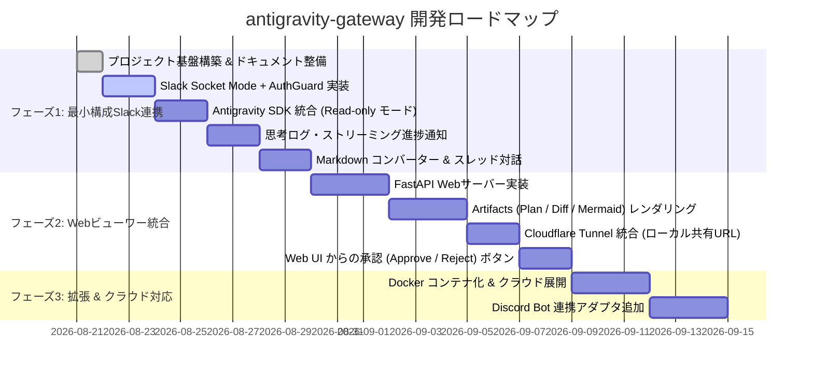

# 04. 開発ロードマップとフェーズ定義

`antigravity-gateway` の開発を安全かつ着実に進めるためのフェーズ分割計画です。

---

## 🗺️ フェーズ概要

---

## 🎯 各フェーズの詳細ゴール

### フェーズ 1: 最小構成・セキュリティ最優先の Slack 連携 (Current Target)

* **目標**: ローカルPC上で常駐し、Slack から安全に対話できる最小実用構成 (PoC) を完成させる。
* **主要機能**:
  1. **Slack Socket Mode 接続**: `slack-bolt` を用いた常駐接続（ポート開放不要）。
  2. **AuthGuard**: 特定の Slack ユーザー ID (`ALLOWED_USER_IDS`) のみ許可。
  3. **Read-only / Safe Mode**: `CapabilitiesConfig` で安全なコード検索・Q&A から開始。
  4. **Thinking / Progress 表示**: エージェントが作業中のステータス（🔍 検索中、🧠 思考中）をSlackに通知。
  5. **スレッド対話**: Slack のスレッド内で会話コンテキストを継続。
  6. **Markdown 簡易変換**: Slack の `mrkdwn` に崩れないよう変換。

---

### フェーズ 2: 軽量 Web ビューワー統合 (Artifacts & Rich UI)

* **目標**: 長文の Implementation Plan や Mermaid 図、Diff をブラウザで綺麗に閲覧・承認できるようにする。
* **主要機能**:
  1. **FastAPI 同居サーバー**: Bot と同じプロセス内で軽量 Web サーバーを起動。
  2. **リッチ Markdown / Mermaid / Diff レンダリング**: ブラウザ上で GitHub ライクな UI 表示。
  3. **Cloudflare Tunnel / ngrok 統合**: コマンド一発でセキュアな外部共有 URL を発行。
  4. **Slack 連携**: Slack には「📝 プランを作成しました [ブラウザで開く]」と要約のみ送信。
  5. **インタラクティブ承認**: Web 画面上で「Approve」を押すと、Slack およびエージェントに実行指示を送信。

---

### フェーズ 3: マルチチャット対応 & クラウドデプロイ

* **目標**: チーム利用および他プラットフォームへの拡張。
* **主要機能**:
  1. **Docker コンテナ化**: `Dockerfile` および `docker-compose.yml` の提供。
  2. **クラウド VPS / Cloud Run デプロイ**: 24時間常時稼働環境の構築。
  3. **Discord Gateway アダプタ**: Discord からも同様に利用可能なインターフェース追加。
  4. **GitHub 連携**: 生成したプランや Diff を自動で GitHub PR / Issue に変換。
