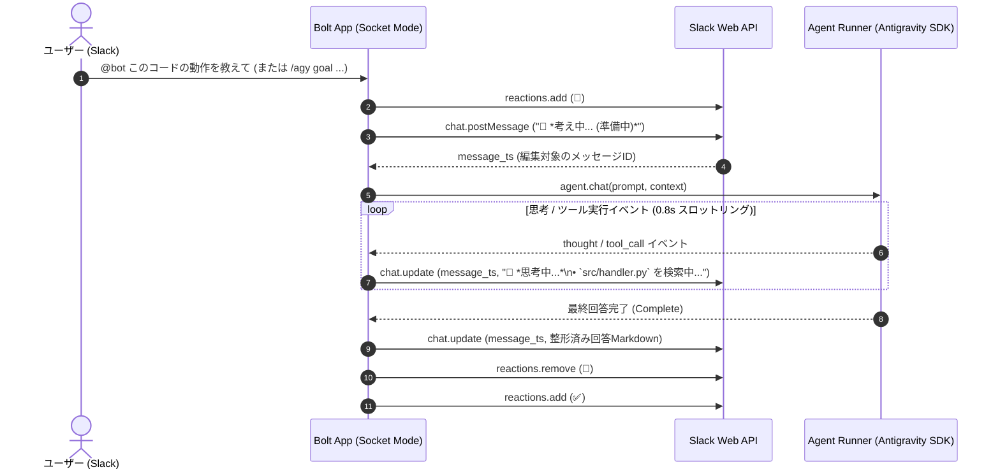

# 06. フェーズ1 詳細設計仕様書 (Slack連携・最小構成) 【確定版】

本ドキュメントは、ディスカッションを経て確定した `antigravity-gateway` のフェーズ1（Slack Socket Mode × Antigravity SDK）の詳細設計書です。

---

## 1. 確定した主要仕様方針

| 項目 | 採用方針 | 詳細仕様 |
| :--- | :--- | :--- |
| **スレッド対話トリガー** | **A案: 自然な対話** | 最初の質問で `@bot` メンションされたスレッド内では、**2回目以降はメンション不要**で発言をコンテキストとして認識・回答。 |
| **進捗表示のUX** | **A案: インプレース編集** | 処理開始時にプレースホルダーメッセージ（`🧠 思考中...`）を投稿し、思考・ツール呼び出しの進捗に合わせて**同一メッセージをリアルタイム編集更新**。完了時に最終回答へ差し替え。 |
| **利用チャンネル制御** | **A案: 特定チャンネル限定** | 誤爆防止のため、`ALLOWED_CHANNEL_IDS` で指定されたチャンネルおよび **DM** のみで動作。 |
| **セッションスコープ** | **ハイブリッド切り替え** | `.env` の `SESSION_MODE` により `thread`（スレッド分離）と `channel`（チャンネル直下タイムライン）を切り替え可能。 |
| **Bot自動参加** | **自動入室機能** | `AUTO_JOIN_CHANNELS=true` により、起動時に全パブリックチャンネルへ自動参加、未参加チャンネルでのメンション時も自律入室。 |
| **スラッシュコマンド** | **Antigravity 全標準コマンド完全網羅** | `/agy <command>` および `/<command>` 形式で、公式の全ワークフローコマンドに対応。 |

---

## 2. Antigravity 全公式スラッシュコマンド体系

本 Gateway では、Antigravity 公式の全スラッシュコマンドを 100% 同等にマッピングしています。

| コマンド | 説明（公式定義） | Slack Gateway での動作仕様 |
| :--- | :--- | :--- |
| **`/agy goal <目標>`** | *Run until the specified goal is completely finished.* | **自律ゴール達成モード**: テスト通過や目標達成までエージェントが自律ループ実行。 |
| **`/agy schedule <指示>`** | *Run an instruction on a recurring schedule or as a one-time timer.* | **スケジュール/タイマー実行**: 非同期タイマーや定期タスクの登録指示。 |
| **`/agy browser <指示>`** | *Invoke a browser agent for web tasks.* | **ブラウザエージェント**: Webページの調査、スクレイピング、Web自動化タスクを実行。 |
| **`/agy grill-me <テーマ>`** | *Interview me to align on a plan.* | **設計インタビュー**: エージェントが人間に質問して設計の穴や要件を詰める壁打ちモード。 |
| **`/agy teamwork <タスク>`** | *Invoke a team of agents to autonomously tackle large projects.* | **サブエージェント協調**: 複数エージェントを立ち上げて並行・分担タスクを実行。 |
| **`/agy learn`** | *Reflect on recent successes or corrections to capture reusable skills or rules.* | **学習・ルール永続化**: 直前の会話やコード修正から得た教訓を `.agents/rules/` にルール化。 |
| **`/agy guide`** | *Provides a comprehensive guide, quick reference, and sitemap.* | **公式ガイド**: Antigravity の全体マニュアル・リファレンスをSlackに表示。 |
| **`/agy customs`** | *Comprehensive guide for Customization System (Skills, Rules, Hooks, MCP).* | **カスタマイズガイド**: Skills, Rules, Hooks などの作成ガイドを表示。 |
| **`/agy btw <質問>`** | *Ask a quick side-question without polluting main context.* | **脇道・単発質問**: メインの会話履歴を一切汚さずに、単発で疑問に回答（Ephemeral/インライン）。 |
| **`/agy reset` / `clear`** | *Reset the current session context.* | **セッション初期化**: 現在のスレッド/チャンネルの履歴をクリア。 |
| **`/agy status`** | *Show gateway status, workspace, and capabilities.* | **ステータス確認**: ワークスペースパス、Gitブランチ、実行権限、稼働状況を表示。 |
| **`/agy help`** | *Show command help and usage hints.* | **ヘルプ表示**: このコマンド一覧と使い方をカード表示。 |

---

## 3. インプレース編集 & 進捗通知シーケンス

Slack API レートリミット（Tier 3）を保護するため、**最低 0.8 秒以上のデバウンス（間引き）** を設けてメッセージを更新します。



---

## 4. 会話セッション管理設計 (`src/session.py`)

* **キー**: `{channel_id}:{thread_ts}`（`SESSION_MODE=thread`）または `{channel_id}`（`SESSION_MODE=channel`）
* **データ構造**:
  ```python
  @dataclass
  class ConversationSession:
      session_key: str
      channel_id: str
      thread_ts: Optional[str]
      user_id: str
      created_at: datetime
      last_active_at: datetime
      history: List[Dict[str, str]]
  ```
* **有効期限 (TTL)**: 最後の発言から **2時間**。2時間経過後は自動破棄。
* **`/btw` コマンド**: セッションの `history` に追加せず、単発実行することで会話文脈をクリーンに保持。
